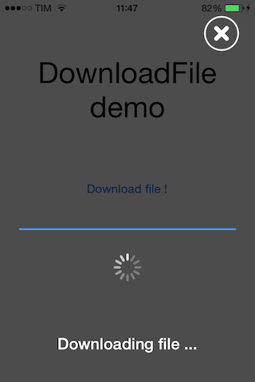

DownloaderWithProgression
==================

Tiny iOS library based on AFNetworking that helps the developer to create a downloading dialog with progress view, with less then 10 lines of code.

Usage
---------
```objective-c
DownloadFile *operation = [[DownloadFile alloc] init];
[operation startDownloadFile:[NSURL URLWithString:@"http:// ..."]
                  outputName:@"downloadedFile"
                loadingTitle:@"Downloading file ..."
          withFinishCallback:^(DownloadFileStatus status, NSError *error) {
			 
            switch (status) {
                case kDownloadFileStatusUserAborted:
                    NSLog(@"User aborted");
                    break;
						
                case kDownloadFileStatusError:
                    NSLog(@"Download error: %@", error);
                    break;
						
                default:
                    NSLog(@"Download OK");
                    break;
            }
        }];
```

Result
---------


How To Get Started 
---------
1. Drag & drop inside your project the folder named DownloaderWithProgression
2. Add to your project the awesome framework [AFNetworking](https://github.com/AFNetworking/AFNetworking)
3. That's all!

Unit Tests
---------
Some unit tests are available [here](/example/DownloadWithProgression/DownloadWithProgressionTests/DownloadWithProgressionTests.m)

License 
---------
DownloaderWithProgression is available under the MIT license. See the LICENSE file for more info.